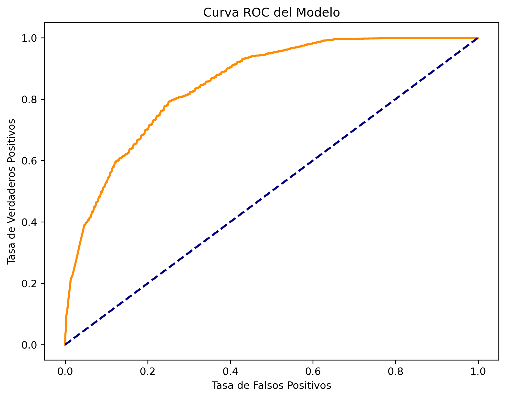
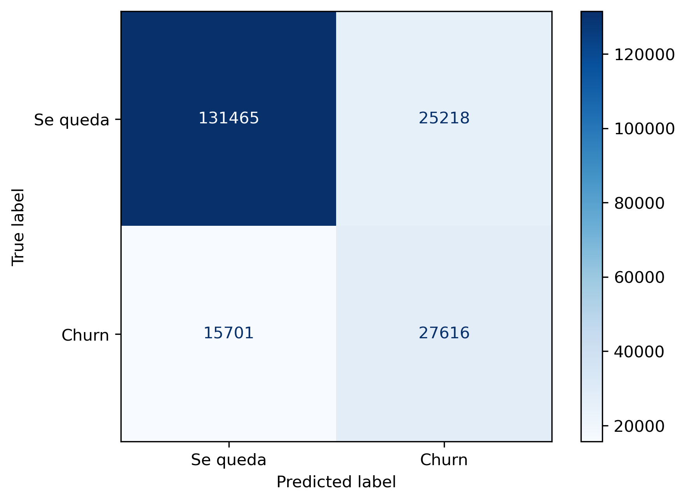
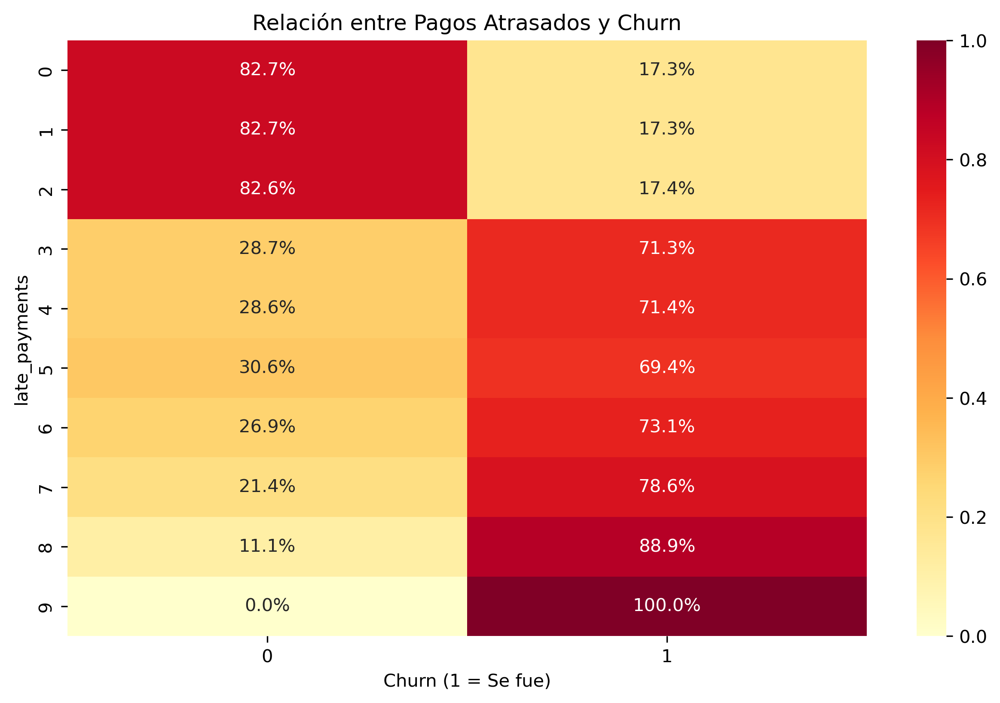
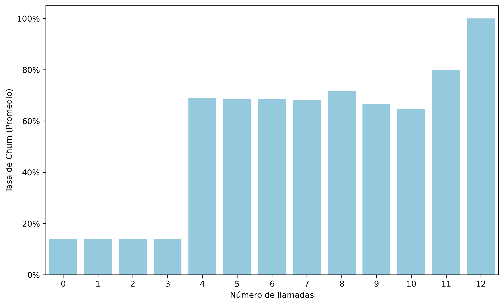
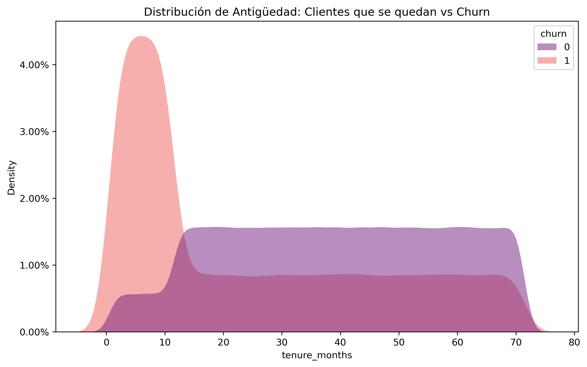

# 📊 Telecom Churn Prediction - Logistic Regression

## 🧠 Descripción

Este proyecto implementa un modelo de **regresión logística en Python** para predecir el abandono de clientes (*churn*) en una empresa de telecomunicaciones.

Se trabaja con un dataset sintético de **1,000,000 de registros**, diseñado para simular un entorno real de análisis de datos, incluyendo valores nulos y variables que requieren transformación.

---

## 🎯 Objetivo del Proyecto

Predecir si un cliente abandonará el servicio:

* `0` → Cliente permanece
* `1` → Cliente abandona

El modelo busca identificar patrones de comportamiento que permitan anticipar el churn y apoyar la toma de decisiones en estrategias de retención.

---

## 📂 Dataset

El dataset contiene información de clientes de una empresa de telecomunicaciones.

### Características principales:

* 1,000,000 registros
* Variables numéricas y categóricas
* Valores nulos (para limpieza de datos)
* Columna de fechas en formato string
* Variable objetivo binaria (`churn`)

### Variables utilizadas en el modelo:

| Variable      | Descripción                     |
| ------------- | ------------------------------- |
| tenure_months | Antigüedad del cliente en meses |
| support_calls | Número de llamadas a soporte    |
| late_payments | Número de pagos atrasados       |
| churn         | Variable objetivo               |

---

## ⚙️ Flujo del Proyecto

El proyecto sigue un pipeline típico de machine learning:

### 1. 🔍 Exploración de Datos (EDA)

* Análisis de distribuciones
* Identificación de valores atípicos
* Evaluación de relaciones entre variables

### 2. 🧹 Limpieza de Datos

* Manejo de valores nulos
* Validación de consistencia

### 3. 🔄 Transformación de Datos

* Conversión de tipos (fechas string → datetime)
* Preparación de variables para modelado

### 4. ⚖️ Escalado de Variables

* Estandarización usando `StandardScaler`
* Aplicado únicamente a variables predictoras

### 5. 🤖 Modelado

* Regresión logística (`LogisticRegression`)
* Separación de datos en entrenamiento y prueba

### 6. 📈 Evaluación del Modelo

* Accuracy
* Precision / Recall
* Matriz de confusión
* Interpretación de coeficientes

---

## 🧪 Tecnologías Utilizadas

* Python
* Pandas
* NumPy
* Scikit-learn
* Matplotlib / Seaborn

---

## 🚀 Cómo ejecutar el proyecto

1. Clonar el repositorio:

```bash
git clone https://github.com/tu-usuario/tu-repo.git
cd tu-repo
```

2. Instalar dependencias:

```bash
pip install -r requirements.txt
```

3. Ejecutar el notebook o script:

```bash
jupyter notebook
```

---

## 📊 Resultados

El modelo permite identificar factores clave asociados al churn, tales como:

* Baja antigüedad del cliente
* Alta frecuencia de llamadas a soporte
* Historial de pagos atrasados

Estos hallazgos pueden ser utilizados para:

* Diseñar estrategias de retención
* Mejorar la experiencia del cliente
* Reducir la tasa de abandono

---

## 💡 Aprendizajes Clave

* Importancia de la limpieza de datos en datasets reales
* Uso correcto del escalado en modelos lineales
* Interpretación de coeficientes en regresión logística
* Manejo de grandes volúmenes de datos (1M registros)

---
## 📊 Visualizaciones del Modelo

A continuación se presentan algunas visualizaciones clave obtenidas durante el análisis y la evaluación del modelo:

### 📉 Curva ROC



---

### 🔲 Matriz de Confusión



---

### 💰 Relación entre pagos atrasados y churn



---

### 📈 Probabilidad de churn



---

### ⏳ Antigüedad del cliente vs churn




## 👨‍💻 Autor: Gilbert Ardila

Proyecto desarrollado como práctica de análisis de datos y machine learning orientado a portafolio profesional.

---

## ⭐ Nota

Este dataset es sintético y fue generado con fines educativos para simular un caso real de negocio.
